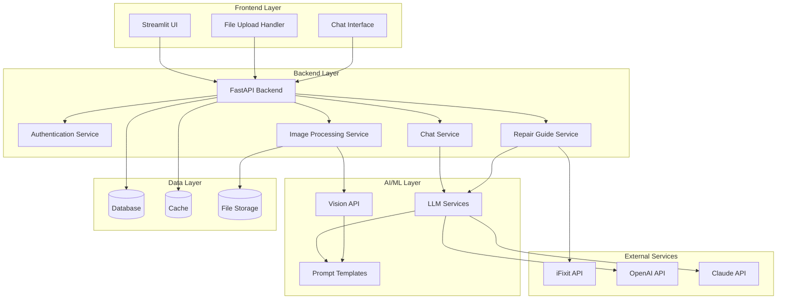
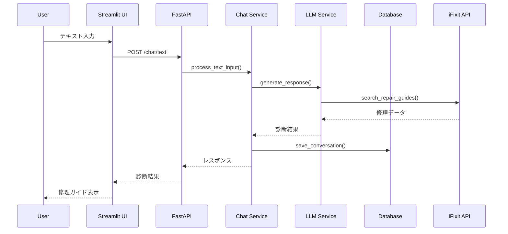
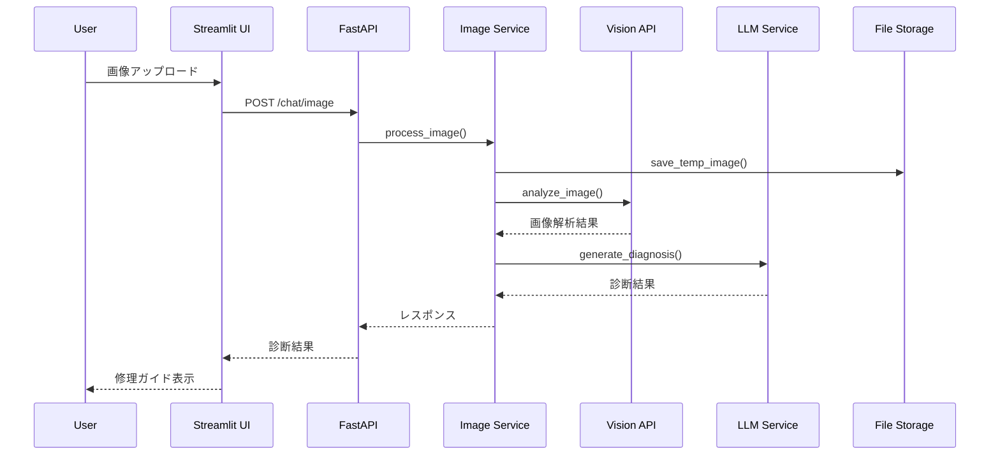
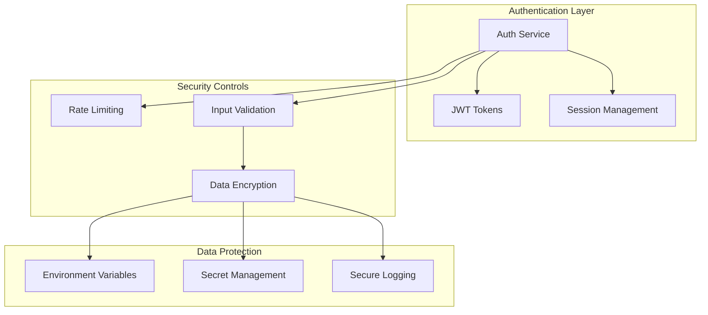
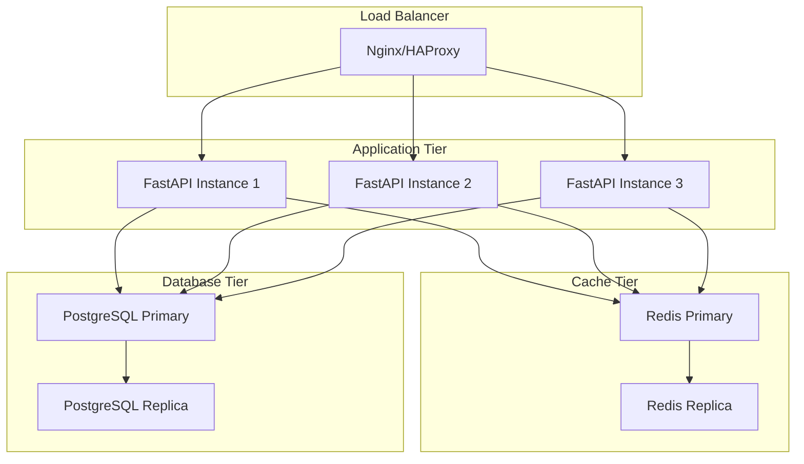
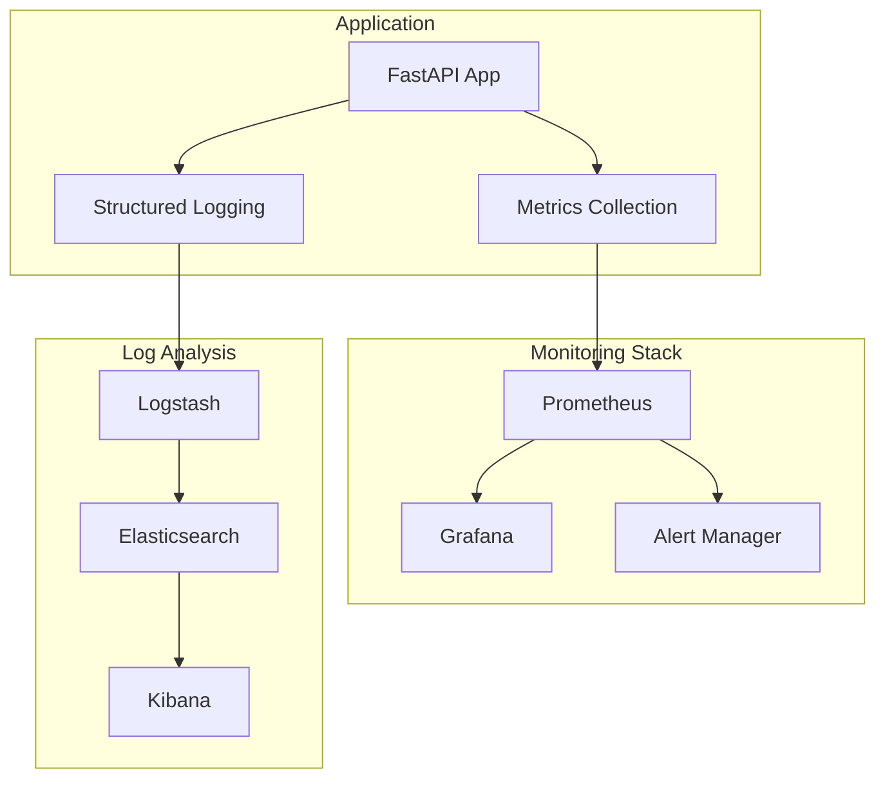
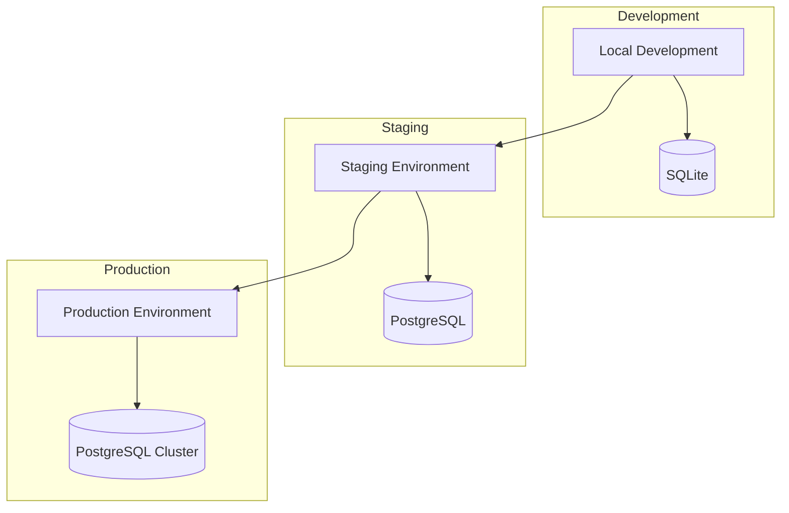

# RepairGPT アーキテクチャ概要

## 1. システム全体構成

### 1.1 高レベルアーキテクチャ

### 1.2 主要コンポーネント

#### フロントエンド層
- **Streamlit UI**: メインユーザーインターフェース
- **File Upload Handler**: 画像アップロード処理
- **Chat Interface**: 対話型チャットインターフェース

#### バックエンド層
- **FastAPI Backend**: REST API エンドポイント
- **Authentication Service**: ユーザー認証・セッション管理
- **Chat Service**: 対話処理とコンテキスト管理
- **Image Processing Service**: 画像解析・処理
- **Repair Guide Service**: 修理ガイド生成・管理

#### AI/ML層
- **LLM Services**: 大規模言語モデル統合
- **Vision API**: 画像認識・解析
- **Prompt Templates**: プロンプト管理・テンプレート

#### データ層
- **Database**: ユーザーデータ、修理履歴、システム設定
- **Cache**: 頻繁にアクセスされるデータのキャッシュ
- **File Storage**: 画像ファイル・ドキュメント保存

## 2. 技術スタック

### 2.1 開発環境

| カテゴリ | 技術 | バージョン | 用途 |
|---------|------|----------|------|
| 言語 | Python | 3.9+ | バックエンド・AI処理 |
| フレームワーク | FastAPI | 0.100+ | REST API開発 |
| UI | Streamlit | 1.25+ | フロントエンド |
| データベース | SQLite | 3.x | 開発環境 |
| データベース | PostgreSQL | 14+ | 本番環境 |
| キャッシュ | Redis | 7.0+ | セッション・キャッシュ |

### 2.2 AI/ML技術

| カテゴリ | 技術 | 用途 |
|---------|------|------|
| LLM | OpenAI GPT-4 | 修理診断・ガイド生成 |
| LLM | Claude-3 | 複雑な修理診断 |
| Vision | OpenAI Vision API | 画像解析・問題特定 |
| プロンプト | Langchain | プロンプト管理 |

### 2.3 外部サービス

| サービス | 用途 | API |
|---------|------|-----|
| iFixit | 修理手順データ | REST API |
| OpenAI | 自然言語処理 | REST API |
| Claude | 高度な推論 | REST API |

## 3. データフロー

### 3.1 テキスト診断フロー

### 3.2 画像診断フロー

## 4. セキュリティアーキテクチャ

### 4.1 認証・認可

### 4.2 セキュリティ要件

| 要件 | 実装 | 説明 |
|------|------|------|
| 認証 | JWT Token | ユーザーセッション管理 |
| 認可 | Role-based | 機能レベルアクセス制御 |
| 暗号化 | AES-256 | データ暗号化 |
| 通信 | HTTPS/TLS | 通信暗号化 |
| 入力検証 | Pydantic | リクエストデータ検証 |
| レート制限 | Redis | API呼び出し制限 |

## 5. スケーラビリティ設計

### 5.1 水平スケーリング

### 5.2 パフォーマンス最適化

| 領域 | 最適化手法 | 実装 |
|------|-----------|------|
| API | レスポンス時間 | 非同期処理、キャッシュ |
| データベース | クエリ最適化 | インデックス、コネクションプール |
| 画像処理 | 処理時間 | 圧縮、並列処理 |
| LLM | 推論時間 | プロンプト最適化、キャッシュ |

## 6. 監視・ログ

### 6.1 監視アーキテクチャ

### 6.2 メトリクス

| カテゴリ | メトリクス | 説明 |
|---------|-----------|------|
| システム | CPU、メモリ、ディスク | リソース使用量 |
| アプリケーション | レスポンス時間、エラー率 | パフォーマンス |
| ビジネス | ユーザー数、修理成功率 | KPI |
| セキュリティ | 認証失敗、異常アクセス | セキュリティイベント |

## 7. デプロイメント

### 7.1 環境構成

### 7.2 CI/CD パイプライン

| ステップ | 内容 | ツール |
|---------|------|--------|
| ソース管理 | Git管理 | GitHub |
| ビルド | テスト実行 | GitHub Actions |
| 品質チェック | リント、カバレッジ | flake8, pytest |
| セキュリティ | 脆弱性スキャン | bandit, safety |
| デプロイ | 自動デプロイ | Docker, Kubernetes |

## 8. 災害復旧

### 8.1 バックアップ戦略

| 対象 | 頻度 | 保存期間 | 方法 |
|------|------|----------|------|
| データベース | 日次 | 30日 | pg_dump |
| ファイル | 週次 | 90日 | rsync |
| 設定 | 変更時 | 無期限 | Git |

### 8.2 復旧手順

1. **インシデント検知**: 監視システムによるアラート
2. **初期対応**: 影響範囲の特定
3. **復旧作業**: バックアップからの復元
4. **動作確認**: システム正常性確認
5. **事後対応**: 原因分析・改善策

## 9. 今後の拡張計画

### 9.1 短期拡張（3-6ヶ月）

- **マルチモーダル対応**: 音声入力・出力
- **リアルタイム通信**: WebSocket対応
- **モバイル対応**: PWA実装

### 9.2 中長期拡張（6-12ヶ月）

- **マイクロサービス化**: サービス分割
- **AI最適化**: カスタムモデル訓練
- **グローバル展開**: 多言語・多地域対応

## 10. 技術的負債管理

### 10.1 既知の技術的負債

| 項目 | 影響度 | 対応予定 |
|------|--------|----------|
| 単一障害点 | 高 | Q2 2024 |
| テストカバレッジ | 中 | Q1 2024 |
| ドキュメント | 低 | 継続的 |

### 10.2 改善計画

- **定期的なリファクタリング**: 月次レビュー
- **技術更新**: 四半期ごとの依存関係更新
- **アーキテクチャ見直し**: 半年ごとの設計レビュー

---

**最終更新日**: 2024-01-09  
**バージョン**: 2.0.0  
**レビュー担当**: RepairGPT開発チーム