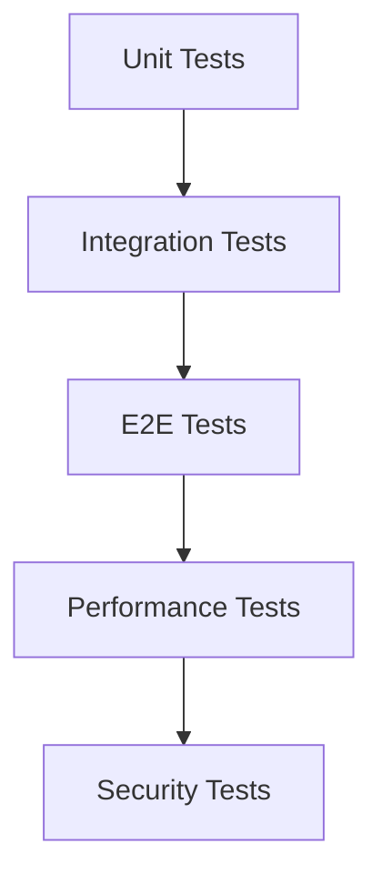

# RepairGPT テスト戦略・ガイドライン

## 1. テスト戦略概要

### 1.1 テスト方針
- **品質保証**: 機能の正確性とパフォーマンスを保証
- **回帰防止**: 新機能追加時の既存機能への影響防止
- **継続的改善**: テスト結果を基にした品質改善
- **自動化**: 手動テストの最小化と効率化

### 1.2 テストレベル


### 1.3 テストカバレッジ目標
- **Unit Tests**: 80%以上
- **Integration Tests**: 主要な機能フロー
- **E2E Tests**: クリティカルなユーザーシナリオ
- **API Tests**: 全エンドポイント

## 2. Unit Testing（単体テスト）

### 2.1 テスト対象
- 個別の関数・メソッド
- クラスの公開メソッド
- ビジネスロジック
- データ変換・バリデーション

### 2.2 テストフレームワーク
```python
# pytest設定（pytest.ini）
[tool:pytest]
minversion = 6.0
addopts = -ra -q --cov=src --cov-report=html --cov-report=term-missing
testpaths = tests/unit
python_files = test_*.py
python_classes = Test*
python_functions = test_*
```

### 2.3 テスト実装例
```python
# tests/unit/test_repair_bot.py
import pytest
from unittest.mock import Mock, patch, MagicMock
from src.chatbot.repair_bot import RepairBot
from src.exceptions import APIConnectionError, DeviceNotSupportedError


class TestRepairBot:
    """RepairBotのテストクラス."""
    
    def setup_method(self):
        """各テストメソッドの前に実行."""
        self.repair_bot = RepairBot()
        
    def teardown_method(self):
        """各テストメソッドの後に実行."""
        # リソースクリーンアップ
        pass
    
    def test_ask_valid_question(self):
        """正常な質問のテスト."""
        # Arrange
        question = "Nintendo Switchの電源が入らない"
        expected_keywords = ["電源", "充電", "確認"]
        
        # Act
        response = self.repair_bot.ask(question)
        
        # Assert
        assert response is not None
        assert isinstance(response, str)
        assert len(response) > 0
        assert any(keyword in response for keyword in expected_keywords)
    
    def test_ask_empty_question(self):
        """空の質問のテスト."""
        # Arrange
        question = ""
        
        # Act & Assert
        with pytest.raises(ValueError, match="Question cannot be empty"):
            self.repair_bot.ask(question)
    
    def test_ask_too_long_question(self):
        """長すぎる質問のテスト."""
        # Arrange
        question = "A" * 1001  # 1000文字制限を超える
        
        # Act & Assert
        with pytest.raises(ValueError, match="Question too long"):
            self.repair_bot.ask(question)
    
    @patch('src.chatbot.repair_bot.openai_client')
    def test_ask_with_api_timeout(self, mock_openai):
        """API タイムアウトのテスト."""
        # Arrange
        mock_openai.chat.completions.create.side_effect = TimeoutError("API timeout")
        question = "テスト質問"
        
        # Act & Assert
        with pytest.raises(APIConnectionError):
            self.repair_bot.ask(question)
    
    @pytest.mark.parametrize("device,issue,expected_keyword", [
        ("nintendo_switch", "power", "充電"),
        ("ps5", "overheating", "冷却"),
        ("iphone", "screen", "画面"),
    ])
    def test_device_specific_responses(self, device, issue, expected_keyword):
        """デバイス固有の応答テスト."""
        # Arrange
        question = f"{device}の{issue}問題"
        
        # Act
        response = self.repair_bot.ask(question)
        
        # Assert
        assert expected_keyword in response
    
    def test_unsupported_device(self):
        """サポートされていないデバイスのテスト."""
        # Arrange
        question = "unsupported_deviceの修理方法"
        
        # Act & Assert
        with pytest.raises(DeviceNotSupportedError):
            self.repair_bot.ask(question)
    
    @patch('src.chatbot.repair_bot.RepairGuideRepository')
    def test_get_repair_guidance_with_mock(self, mock_repo):
        """モックを使用したテスト."""
        # Arrange
        mock_guide = Mock()
        mock_guide.title = "テスト修理ガイド"
        mock_guide.steps = ["ステップ1", "ステップ2"]
        mock_repo.return_value.get_by_device_and_issue.return_value = [mock_guide]
        
        # Act
        guidance = self.repair_bot.get_repair_guidance("nintendo_switch", "power")
        
        # Assert
        assert guidance is not None
        assert "テスト修理ガイド" in guidance
        mock_repo.return_value.get_by_device_and_issue.assert_called_once_with(
            "nintendo_switch", "power"
        )
```

### 2.4 テストデータ・フィクスチャ
```python
# tests/fixtures/repair_data.py
import pytest
from datetime import datetime
from src.models.repair_guide import RepairGuide


@pytest.fixture
def sample_repair_guide():
    """サンプル修理ガイド."""
    return {
        "id": "repair_001",
        "title": "Nintendo Switch電源問題修理",
        "device_id": "nintendo_switch",
        "issue_id": "power",
        "difficulty": "beginner",
        "estimated_time": 30,
        "tools_required": ["プラスドライバー", "マルチメーター"],
        "parts_required": ["充電ケーブル"],
        "safety_warnings": ["電源を切断してください"],
        "success_rate": 0.85,
        "created_at": datetime.now()
    }

@pytest.fixture
def mock_database():
    """モックデータベースセッション."""
    from unittest.mock import Mock
    mock_db = Mock()
    return mock_db

@pytest.fixture
def sample_user():
    """サンプルユーザー."""
    return {
        "id": "user_001",
        "username": "testuser",
        "email": "test@example.com",
        "is_active": True
    }
```

## 3. Integration Testing（統合テスト）

### 3.1 テスト対象
- API エンドポイント
- データベース操作
- 外部サービス連携
- モジュール間の相互作用

### 3.2 テスト実装例
```python
# tests/integration/test_chat_api.py
import pytest
from fastapi.testclient import TestClient
from sqlalchemy import create_engine
from sqlalchemy.orm import sessionmaker
from src.main import app
from src.models.database import Base, get_db


# テスト用データベース設定
SQLALCHEMY_DATABASE_URL = "sqlite:///./test.db"
engine = create_engine(SQLALCHEMY_DATABASE_URL, connect_args={"check_same_thread": False})
TestingSessionLocal = sessionmaker(autocommit=False, autoflush=False, bind=engine)


@pytest.fixture
def client():
    """テストクライアント."""
    Base.metadata.create_all(bind=engine)
    
    def override_get_db():
        db = TestingSessionLocal()
        try:
            yield db
        finally:
            db.close()
    
    app.dependency_overrides[get_db] = override_get_db
    
    with TestClient(app) as test_client:
        yield test_client
    
    Base.metadata.drop_all(bind=engine)


class TestChatAPI:
    """Chat APIの統合テスト."""
    
    def test_start_chat_session(self, client):
        """チャットセッション開始のテスト."""
        # Arrange
        payload = {
            "device_type": "nintendo_switch",
            "user_id": "user_001"
        }
        
        # Act
        response = client.post("/api/v1/chat/start", json=payload)
        
        # Assert
        assert response.status_code == 200
        data = response.json()
        assert data["success"] is True
        assert "session_id" in data["data"]
        assert "Nintendo Switch" in data["data"]["welcome_message"]
    
    def test_send_message(self, client):
        """メッセージ送信のテスト."""
        # Arrange - セッション開始
        start_payload = {
            "device_type": "nintendo_switch",
            "user_id": "user_001"
        }
        start_response = client.post("/api/v1/chat/start", json=start_payload)
        session_id = start_response.json()["data"]["session_id"]
        
        # Act - メッセージ送信
        message_payload = {
            "session_id": session_id,
            "message": "電源が入らない"
        }
        response = client.post("/api/v1/chat/message", json=message_payload)
        
        # Assert
        assert response.status_code == 200
        data = response.json()
        assert data["success"] is True
        assert "response" in data["data"]
        assert "repair_steps" in data["data"]
    
    def test_get_chat_history(self, client):
        """チャット履歴取得のテスト."""
        # Arrange - セッション開始とメッセージ送信
        start_payload = {"device_type": "nintendo_switch", "user_id": "user_001"}
        start_response = client.post("/api/v1/chat/start", json=start_payload)
        session_id = start_response.json()["data"]["session_id"]
        
        message_payload = {
            "session_id": session_id,
            "message": "テストメッセージ"
        }
        client.post("/api/v1/chat/message", json=message_payload)
        
        # Act
        response = client.get(f"/api/v1/chat/history/{session_id}")
        
        # Assert
        assert response.status_code == 200
        data = response.json()
        assert data["success"] is True
        assert len(data["data"]["messages"]) >= 2  # user message + bot response
    
    def test_invalid_session_id(self, client):
        """無効なセッションIDのテスト."""
        # Arrange
        invalid_session_id = "invalid_session_id"
        
        # Act
        response = client.get(f"/api/v1/chat/history/{invalid_session_id}")
        
        # Assert
        assert response.status_code == 404
        data = response.json()
        assert data["success"] is False
```

### 3.3 データベーステスト
```python
# tests/integration/test_database_operations.py
import pytest
from sqlalchemy import create_engine
from sqlalchemy.orm import sessionmaker
from src.models.database import Base
from src.models.repair_guide import RepairGuide
from src.models.repositories.repair_guide_repository import RepairGuideRepository


@pytest.fixture
def db_session():
    """テスト用データベースセッション."""
    engine = create_engine("sqlite:///:memory:")
    Base.metadata.create_all(bind=engine)
    SessionLocal = sessionmaker(autocommit=False, autoflush=False, bind=engine)
    session = SessionLocal()
    
    yield session
    
    session.close()


class TestRepairGuideRepository:
    """修理ガイドリポジトリのテスト."""
    
    def test_create_repair_guide(self, db_session):
        """修理ガイド作成のテスト."""
        # Arrange
        repo = RepairGuideRepository(db_session)
        guide_data = {
            "title": "テスト修理ガイド",
            "device_id": "nintendo_switch",
            "issue_id": "power",
            "difficulty": "beginner"
        }
        
        # Act
        guide = repo.create(guide_data)
        
        # Assert
        assert guide.id is not None
        assert guide.title == "テスト修理ガイド"
        assert guide.device_id == "nintendo_switch"
        
        # データベースに保存されたことを確認
        saved_guide = repo.get_by_id(guide.id)
        assert saved_guide is not None
        assert saved_guide.title == "テスト修理ガイド"
    
    def test_get_by_device_and_issue(self, db_session):
        """デバイスと問題による検索のテスト."""
        # Arrange
        repo = RepairGuideRepository(db_session)
        
        # テストデータ作成
        guide1_data = {
            "title": "Switch電源修理1",
            "device_id": "nintendo_switch",
            "issue_id": "power",
            "difficulty": "beginner",
            "success_rate": 0.8
        }
        guide2_data = {
            "title": "Switch電源修理2",
            "device_id": "nintendo_switch",
            "issue_id": "power",
            "difficulty": "intermediate",
            "success_rate": 0.9
        }
        
        repo.create(guide1_data)
        repo.create(guide2_data)
        
        # Act
        guides = repo.get_by_device_and_issue("nintendo_switch", "power")
        
        # Assert
        assert len(guides) == 2
        # 成功率の高い順にソートされていることを確認
        assert guides[0].success_rate >= guides[1].success_rate
```

## 4. E2E Testing（エンドツーエンドテスト）

### 4.1 テスト対象
- ユーザーシナリオ全体
- フロントエンドとバックエンドの連携
- ブラウザでの動作確認

### 4.2 Playwright設定
```python
# tests/e2e/conftest.py
import pytest
from playwright.sync_api import sync_playwright


@pytest.fixture(scope="session")
def browser():
    """ブラウザインスタンス."""
    with sync_playwright() as p:
        browser = p.chromium.launch(headless=False)
        yield browser
        browser.close()


@pytest.fixture
def page(browser):
    """ページインスタンス."""
    context = browser.new_context()
    page = context.new_page()
    yield page
    context.close()
```

### 4.3 E2Eテスト実装例
```python
# tests/e2e/test_repair_flow.py
import pytest
from playwright.sync_api import Page, expect


class TestRepairFlow:
    """修理フローのE2Eテスト."""
    
    def test_complete_repair_consultation(self, page: Page):
        """完全な修理相談フローのテスト."""
        # Arrange
        page.goto("http://localhost:8501")  # Streamlit app
        
        # Act & Assert
        # 1. ホーム画面の確認
        expect(page.locator("h1")).to_contain_text("RepairGPT")
        
        # 2. デバイス選択
        device_select = page.locator("select[data-testid='device-select']")
        device_select.select_option("nintendo_switch")
        
        # 3. 問題の入力
        message_input = page.locator("textarea[data-testid='message-input']")
        message_input.fill("電源が入らない")
        
        # 4. 送信ボタンクリック
        send_button = page.locator("button[data-testid='send-button']")
        send_button.click()
        
        # 5. 応答の確認
        response_area = page.locator("[data-testid='response-area']")
        expect(response_area).to_contain_text("充電", timeout=10000)
        
        # 6. 修理手順の表示確認
        repair_steps = page.locator("[data-testid='repair-steps']")
        expect(repair_steps).to_be_visible()
        
        # 7. 画像アップロード（オプション）
        file_input = page.locator("input[type='file']")
        file_input.set_input_files("tests/fixtures/switch_image.jpg")
        
        # 8. 画像解析結果の確認
        image_analysis = page.locator("[data-testid='image-analysis']")
        expect(image_analysis).to_be_visible(timeout=15000)
    
    def test_invalid_device_selection(self, page: Page):
        """無効なデバイス選択のテスト."""
        # Arrange
        page.goto("http://localhost:8501")
        
        # Act
        # 無効なデバイスを選択（存在しない場合のテスト）
        message_input = page.locator("textarea[data-testid='message-input']")
        message_input.fill("未知のデバイスの修理")
        
        send_button = page.locator("button[data-testid='send-button']")
        send_button.click()
        
        # Assert
        error_message = page.locator("[data-testid='error-message']")
        expect(error_message).to_contain_text("サポートされていないデバイス")
    
    def test_image_upload_flow(self, page: Page):
        """画像アップロードフローのテスト."""
        # Arrange
        page.goto("http://localhost:8501")
        
        # Act
        # デバイス選択
        device_select = page.locator("select[data-testid='device-select']")
        device_select.select_option("nintendo_switch")
        
        # 画像アップロード
        file_input = page.locator("input[type='file']")
        file_input.set_input_files("tests/fixtures/switch_damaged.jpg")
        
        # アップロード完了を待つ
        upload_success = page.locator("[data-testid='upload-success']")
        expect(upload_success).to_be_visible(timeout=10000)
        
        # 問題の入力
        message_input = page.locator("textarea[data-testid='message-input']")
        message_input.fill("この画像の問題を診断してください")
        
        # 送信
        send_button = page.locator("button[data-testid='send-button']")
        send_button.click()
        
        # Assert
        # 画像解析結果の確認
        image_analysis = page.locator("[data-testid='image-analysis']")
        expect(image_analysis).to_be_visible(timeout=15000)
        expect(image_analysis).to_contain_text("画像")
```

## 5. Performance Testing（パフォーマンステスト）

### 5.1 ロードテスト
```python
# tests/performance/test_load.py
import asyncio
import aiohttp
import pytest
from concurrent.futures import ThreadPoolExecutor
import time


class TestLoadPerformance:
    """ロードテストクラス."""
    
    @pytest.mark.asyncio
    async def test_chat_api_load(self):
        """チャットAPIのロードテスト."""
        base_url = "http://localhost:8000"
        concurrent_users = 50
        requests_per_user = 10
        
        async def make_request(session, user_id):
            """単一リクエストを実行."""
            payload = {
                "device_type": "nintendo_switch",
                "user_id": f"user_{user_id}",
                "message": "電源が入らない"
            }
            
            start_time = time.time()
            async with session.post(f"{base_url}/api/v1/chat/message", json=payload) as response:
                await response.json()
                end_time = time.time()
                return end_time - start_time
        
        async def user_scenario(user_id):
            """ユーザーシナリオを実行."""
            async with aiohttp.ClientSession() as session:
                response_times = []
                for i in range(requests_per_user):
                    response_time = await make_request(session, f"{user_id}_{i}")
                    response_times.append(response_time)
                return response_times
        
        # 並行実行
        start_time = time.time()
        tasks = [user_scenario(i) for i in range(concurrent_users)]
        results = await asyncio.gather(*tasks)
        end_time = time.time()
        
        # 結果分析
        all_response_times = [rt for user_results in results for rt in user_results]
        avg_response_time = sum(all_response_times) / len(all_response_times)
        max_response_time = max(all_response_times)
        total_requests = concurrent_users * requests_per_user
        total_time = end_time - start_time
        throughput = total_requests / total_time
        
        print(f"Average response time: {avg_response_time:.2f}s")
        print(f"Max response time: {max_response_time:.2f}s")
        print(f"Throughput: {throughput:.2f} req/s")
        
        # アサーション
        assert avg_response_time < 5.0  # 平均応答時間5秒以下
        assert max_response_time < 10.0  # 最大応答時間10秒以下
        assert throughput > 10  # 10 req/s以上
```

### 5.2 メモリ使用量テスト
```python
# tests/performance/test_memory.py
import psutil
import pytest
import time
from src.chatbot.repair_bot import RepairBot


class TestMemoryUsage:
    """メモリ使用量テストクラス."""
    
    def test_memory_usage_under_load(self):
        """負荷時のメモリ使用量テスト."""
        # 初期メモリ使用量を記録
        process = psutil.Process()
        initial_memory = process.memory_info().rss / 1024 / 1024  # MB
        
        repair_bot = RepairBot()
        
        # 大量のリクエストを処理
        for i in range(1000):
            question = f"Nintendo Switchの問題{i}"
            response = repair_bot.ask(question)
            
            # 100回ごとにメモリ使用量をチェック
            if i % 100 == 0:
                current_memory = process.memory_info().rss / 1024 / 1024
                memory_increase = current_memory - initial_memory
                
                print(f"Request {i}: Memory usage {current_memory:.2f} MB (+{memory_increase:.2f} MB)")
                
                # メモリ使用量が異常に増加していないかチェック
                assert memory_increase < 100  # 100MB以上の増加は異常
```

## 6. Security Testing（セキュリティテスト）

### 6.1 SQLインジェクション対策テスト
```python
# tests/security/test_sql_injection.py
import pytest
from fastapi.testclient import TestClient
from src.main import app


class TestSQLInjection:
    """SQLインジェクション対策テスト."""
    
    def test_sql_injection_in_search(self):
        """検索機能でのSQLインジェクションテスト."""
        client = TestClient(app)
        
        # SQLインジェクションを試行
        malicious_inputs = [
            "'; DROP TABLE users; --",
            "' OR '1'='1",
            "' UNION SELECT * FROM users --",
            "1' AND (SELECT COUNT(*) FROM users) > 0 --"
        ]
        
        for malicious_input in malicious_inputs:
            response = client.get(f"/api/v1/repairs/search?device={malicious_input}")
            
            # SQLインジェクションが成功していないことを確認
            assert response.status_code in [400, 422]  # バリデーションエラー
            assert "error" in response.json()
```

### 6.2 XSS対策テスト
```python
# tests/security/test_xss.py
import pytest
from src.utils.validators import sanitize_user_input


class TestXSSPrevention:
    """XSS対策テスト."""
    
    def test_script_tag_sanitization(self):
        """scriptタグのサニタイゼーションテスト."""
        malicious_input = "<script>alert('XSS')</script>"
        sanitized = sanitize_user_input(malicious_input)
        
        assert "<script>" not in sanitized
        assert "&lt;script&gt;" in sanitized
    
    def test_javascript_url_sanitization(self):
        """JavaScript URLのサニタイゼーションテスト."""
        malicious_input = "javascript:alert('XSS')"
        
        with pytest.raises(ValueError, match="Dangerous content detected"):
            sanitize_user_input(malicious_input)
    
    def test_event_handler_sanitization(self):
        """イベントハンドラーのサニタイゼーションテスト."""
        malicious_input = ""
        
        with pytest.raises(ValueError, match="Dangerous content detected"):
            sanitize_user_input(malicious_input)
```

## 7. テスト自動化・CI/CD

### 7.1 GitHub Actions設定
```yaml
# .github/workflows/test.yml
name: Test Suite

on:
  push:
    branches: [ main, develop ]
  pull_request:
    branches: [ main, develop ]

jobs:
  test:
    runs-on: ubuntu-latest
    strategy:
      matrix:
        python-version: [3.9, 3.10, 3.11]
    
    steps:
    - uses: actions/checkout@v3
    
    - name: Set up Python ${{ matrix.python-version }}
      uses: actions/setup-python@v3
      with:
        python-version: ${{ matrix.python-version }}
    
    - name: Install dependencies
      run: |
        python -m pip install --upgrade pip
        pip install -r requirements.txt
        pip install -r requirements-test.txt
    
    - name: Run unit tests
      run: |
        pytest tests/unit/ --cov=src --cov-report=xml
    
    - name: Run integration tests
      run: |
        pytest tests/integration/
    
    - name: Upload coverage to Codecov
      uses: codecov/codecov-action@v3
      with:
        file: ./coverage.xml
        flags: unittests
    
    - name: Run security tests
      run: |
        bandit -r src/
        safety check
    
    - name: Run linting
      run: |
        flake8 src/ tests/
        black --check src/ tests/
        mypy src/
  
  e2e:
    runs-on: ubuntu-latest
    steps:
    - uses: actions/checkout@v3
    
    - name: Set up Python
      uses: actions/setup-python@v3
      with:
        python-version: 3.9
    
    - name: Start application
      run: |
        pip install -r requirements.txt
        python -m uvicorn src.main:app --host 0.0.0.0 --port 8000 &
        streamlit run app.py --server.port 8501 &
        sleep 10
    
    - name: Install Playwright
      run: |
        pip install playwright
        playwright install chromium
    
    - name: Run E2E tests
      run: |
        pytest tests/e2e/
```

### 7.2 テスト結果レポート
```python
# tests/conftest.py
import pytest
import json
from datetime import datetime


@pytest.fixture(scope="session", autouse=True)
def test_report():
    """テストレポートの生成."""
    yield
    
    # テスト結果をJSONファイルに出力
    report_data = {
        "timestamp": datetime.now().isoformat(),
        "test_results": {
            "unit_tests": "passed",
            "integration_tests": "passed",
            "e2e_tests": "passed"
        }
    }
    
    with open("test_report.json", "w") as f:
        json.dump(report_data, f, indent=2)
```

## 8. テスト品質管理

### 8.1 テストメトリクス
- **コードカバレッジ**: 80%以上を維持
- **テスト実行時間**: 10分以内
- **フレーキーテスト**: 0%を目標
- **テスト成功率**: 95%以上

### 8.2 テストメンテナンス
```python
# tests/utils/test_maintenance.py
import pytest
import time
from functools import wraps


def flaky_test_detector(max_retries=3):
    """フレーキーテストの検出デコレータ."""
    def decorator(func):
        @wraps(func)
        def wrapper(*args, **kwargs):
            for attempt in range(max_retries):
                try:
                    return func(*args, **kwargs)
                except Exception as e:
                    if attempt == max_retries - 1:
                        raise
                    print(f"Test failed on attempt {attempt + 1}: {e}")
                    time.sleep(1)
            return None
        return wrapper
    return decorator


@flaky_test_detector(max_retries=3)
def test_potentially_flaky_function():
    """フレーキーなテストの例."""
    # 時々失敗する可能性のあるテスト
    pass
```

## 9. テスト環境管理

### 9.1 Docker Test Environment
```dockerfile
# Dockerfile.test
FROM python:3.9-slim

WORKDIR /app

COPY requirements.txt requirements-test.txt ./
RUN pip install -r requirements.txt -r requirements-test.txt

COPY . .

CMD ["pytest", "tests/", "--cov=src", "--cov-report=html"]
```

### 9.2 テストデータベース
```python
# tests/utils/database.py
import os
import pytest
from sqlalchemy import create_engine
from sqlalchemy.orm import sessionmaker
from src.models.database import Base


@pytest.fixture(scope="session")
def test_database():
    """テスト用データベースの作成."""
    database_url = os.getenv("TEST_DATABASE_URL", "sqlite:///:memory:")
    engine = create_engine(database_url)
    
    Base.metadata.create_all(bind=engine)
    
    SessionLocal = sessionmaker(autocommit=False, autoflush=False, bind=engine)
    
    yield SessionLocal
    
    Base.metadata.drop_all(bind=engine)
```

## 10. 継続的改善

### 10.1 テスト結果分析
- **週次**: テスト実行時間の分析
- **月次**: テストカバレッジの確認
- **四半期**: テスト戦略の見直し

### 10.2 テスト改善計画
1. **自動化拡大**: 手動テストの自動化
2. **パフォーマンス改善**: テスト実行時間の短縮
3. **品質向上**: テストの信頼性向上
4. **新技術導入**: 新しいテストツールの評価・導入