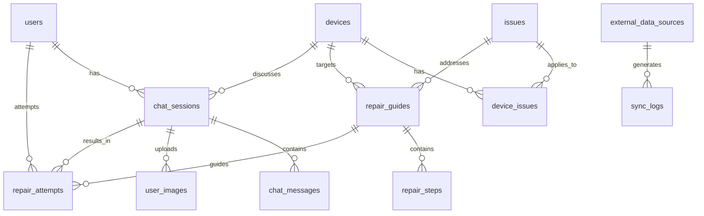

# RepairGPT データベース設計書

## 1. データベース概要

### 1.1 使用技術
- **開発環境**: SQLite 3.x
- **本番環境**: PostgreSQL 14+
- **ORM**: SQLAlchemy 2.0
- **マイグレーション**: Alembic

### 1.2 命名規則
- **テーブル名**: snake_case (複数形)
- **カラム名**: snake_case
- **インデックス名**: `idx_{table}_{column}`
- **外部キー名**: `fk_{table}_{referenced_table}`

## 2. テーブル設計

### 2.1 Users（ユーザー）
```sql
CREATE TABLE users (
    id UUID PRIMARY KEY DEFAULT gen_random_uuid(),
    username VARCHAR(50) NOT NULL UNIQUE,
    email VARCHAR(255) NOT NULL UNIQUE,
    password_hash VARCHAR(255) NOT NULL,
    is_active BOOLEAN DEFAULT TRUE,
    created_at TIMESTAMP DEFAULT CURRENT_TIMESTAMP,
    updated_at TIMESTAMP DEFAULT CURRENT_TIMESTAMP,
    last_login_at TIMESTAMP
);

CREATE INDEX idx_users_email ON users(email);
CREATE INDEX idx_users_username ON users(username);
```

### 2.2 Devices（デバイス）
```sql
CREATE TABLE devices (
    id VARCHAR(50) PRIMARY KEY,
    name VARCHAR(100) NOT NULL,
    category VARCHAR(50) NOT NULL,
    manufacturer VARCHAR(100),
    model_variants TEXT[], -- PostgreSQL array
    release_year INTEGER,
    description TEXT,
    image_url VARCHAR(500),
    is_active BOOLEAN DEFAULT TRUE,
    created_at TIMESTAMP DEFAULT CURRENT_TIMESTAMP,
    updated_at TIMESTAMP DEFAULT CURRENT_TIMESTAMP
);

CREATE INDEX idx_devices_category ON devices(category);
CREATE INDEX idx_devices_manufacturer ON devices(manufacturer);
```

### 2.3 Issues（問題カテゴリ）
```sql
CREATE TABLE issues (
    id VARCHAR(50) PRIMARY KEY,
    name VARCHAR(100) NOT NULL,
    description TEXT,
    category VARCHAR(50) NOT NULL,
    severity VARCHAR(20) DEFAULT 'medium',
    is_active BOOLEAN DEFAULT TRUE,
    created_at TIMESTAMP DEFAULT CURRENT_TIMESTAMP
);

CREATE INDEX idx_issues_category ON issues(category);
```

### 2.4 Device_Issues（デバイス-問題の関連）
```sql
CREATE TABLE device_issues (
    device_id VARCHAR(50) REFERENCES devices(id),
    issue_id VARCHAR(50) REFERENCES issues(id),
    frequency DECIMAL(3,2) DEFAULT 0.0,
    difficulty VARCHAR(20) DEFAULT 'medium',
    PRIMARY KEY (device_id, issue_id)
);
```

### 2.5 Repair_Guides（修理ガイド）
```sql
CREATE TABLE repair_guides (
    id UUID PRIMARY KEY DEFAULT gen_random_uuid(),
    title VARCHAR(200) NOT NULL,
    device_id VARCHAR(50) NOT NULL REFERENCES devices(id),
    issue_id VARCHAR(50) NOT NULL REFERENCES issues(id),
    difficulty VARCHAR(20) NOT NULL DEFAULT 'medium',
    estimated_time INTEGER, -- minutes
    success_rate DECIMAL(3,2) DEFAULT 0.0,
    tools_required TEXT[], -- JSON array
    parts_required TEXT[], -- JSON array
    safety_warnings TEXT[], -- JSON array
    description TEXT,
    is_active BOOLEAN DEFAULT TRUE,
    created_by UUID REFERENCES users(id),
    created_at TIMESTAMP DEFAULT CURRENT_TIMESTAMP,
    updated_at TIMESTAMP DEFAULT CURRENT_TIMESTAMP
);

CREATE INDEX idx_repair_guides_device ON repair_guides(device_id);
CREATE INDEX idx_repair_guides_issue ON repair_guides(issue_id);
CREATE INDEX idx_repair_guides_difficulty ON repair_guides(difficulty);
```

### 2.6 Repair_Steps（修理手順）
```sql
CREATE TABLE repair_steps (
    id UUID PRIMARY KEY DEFAULT gen_random_uuid(),
    repair_guide_id UUID NOT NULL REFERENCES repair_guides(id) ON DELETE CASCADE,
    step_number INTEGER NOT NULL,
    title VARCHAR(200) NOT NULL,
    description TEXT NOT NULL,
    image_url VARCHAR(500),
    warning TEXT,
    tips TEXT,
    estimated_time INTEGER, -- minutes
    created_at TIMESTAMP DEFAULT CURRENT_TIMESTAMP
);

CREATE INDEX idx_repair_steps_guide ON repair_steps(repair_guide_id);
CREATE UNIQUE INDEX idx_repair_steps_guide_step ON repair_steps(repair_guide_id, step_number);
```

### 2.7 Chat_Sessions（チャットセッション）
```sql
CREATE TABLE chat_sessions (
    id UUID PRIMARY KEY DEFAULT gen_random_uuid(),
    user_id UUID REFERENCES users(id),
    device_id VARCHAR(50) REFERENCES devices(id),
    issue_id VARCHAR(50) REFERENCES issues(id),
    session_data JSONB, -- セッション固有のデータ
    status VARCHAR(20) DEFAULT 'active',
    started_at TIMESTAMP DEFAULT CURRENT_TIMESTAMP,
    ended_at TIMESTAMP,
    last_activity_at TIMESTAMP DEFAULT CURRENT_TIMESTAMP
);

CREATE INDEX idx_chat_sessions_user ON chat_sessions(user_id);
CREATE INDEX idx_chat_sessions_device ON chat_sessions(device_id);
CREATE INDEX idx_chat_sessions_status ON chat_sessions(status);
```

### 2.8 Chat_Messages（チャットメッセージ）
```sql
CREATE TABLE chat_messages (
    id UUID PRIMARY KEY DEFAULT gen_random_uuid(),
    session_id UUID NOT NULL REFERENCES chat_sessions(id) ON DELETE CASCADE,
    sender VARCHAR(10) NOT NULL, -- 'user' or 'bot'
    content TEXT NOT NULL,
    message_type VARCHAR(20) DEFAULT 'text', -- 'text', 'image', 'repair_guide'
    metadata JSONB, -- 追加データ（画像URL等）
    created_at TIMESTAMP DEFAULT CURRENT_TIMESTAMP
);

CREATE INDEX idx_chat_messages_session ON chat_messages(session_id);
CREATE INDEX idx_chat_messages_created_at ON chat_messages(created_at);
```

### 2.9 User_Images（ユーザー画像）
```sql
CREATE TABLE user_images (
    id UUID PRIMARY KEY DEFAULT gen_random_uuid(),
    session_id UUID NOT NULL REFERENCES chat_sessions(id),
    filename VARCHAR(255) NOT NULL,
    original_filename VARCHAR(255),
    file_path VARCHAR(500) NOT NULL,
    file_size INTEGER,
    mime_type VARCHAR(100),
    description TEXT,
    analysis_result JSONB, -- 画像解析結果
    created_at TIMESTAMP DEFAULT CURRENT_TIMESTAMP,
    expires_at TIMESTAMP -- 自動削除用
);

CREATE INDEX idx_user_images_session ON user_images(session_id);
CREATE INDEX idx_user_images_expires ON user_images(expires_at);
```

### 2.10 Repair_Attempts（修理試行）
```sql
CREATE TABLE repair_attempts (
    id UUID PRIMARY KEY DEFAULT gen_random_uuid(),
    user_id UUID REFERENCES users(id),
    session_id UUID NOT NULL REFERENCES chat_sessions(id),
    repair_guide_id UUID REFERENCES repair_guides(id),
    device_id VARCHAR(50) NOT NULL REFERENCES devices(id),
    issue_id VARCHAR(50) NOT NULL REFERENCES issues(id),
    status VARCHAR(20) DEFAULT 'in_progress',
    success BOOLEAN,
    completion_rate DECIMAL(3,2) DEFAULT 0.0,
    feedback TEXT,
    rating INTEGER CHECK (rating >= 1 AND rating <= 5),
    started_at TIMESTAMP DEFAULT CURRENT_TIMESTAMP,
    completed_at TIMESTAMP
);

CREATE INDEX idx_repair_attempts_user ON repair_attempts(user_id);
CREATE INDEX idx_repair_attempts_guide ON repair_attempts(repair_guide_id);
CREATE INDEX idx_repair_attempts_device ON repair_attempts(device_id);
```

### 2.11 External_Data_Sources（外部データソース）
```sql
CREATE TABLE external_data_sources (
    id UUID PRIMARY KEY DEFAULT gen_random_uuid(),
    name VARCHAR(100) NOT NULL,
    source_type VARCHAR(50) NOT NULL, -- 'ifixit', 'reddit', 'youtube'
    base_url VARCHAR(500),
    api_key_name VARCHAR(100),
    last_sync_at TIMESTAMP,
    sync_status VARCHAR(20) DEFAULT 'pending',
    config JSONB, -- ソース固有の設定
    is_active BOOLEAN DEFAULT TRUE,
    created_at TIMESTAMP DEFAULT CURRENT_TIMESTAMP
);
```

### 2.12 Sync_Logs（同期ログ）
```sql
CREATE TABLE sync_logs (
    id UUID PRIMARY KEY DEFAULT gen_random_uuid(),
    source_id UUID NOT NULL REFERENCES external_data_sources(id),
    sync_type VARCHAR(50) NOT NULL,
    records_processed INTEGER DEFAULT 0,
    records_created INTEGER DEFAULT 0,
    records_updated INTEGER DEFAULT 0,
    records_failed INTEGER DEFAULT 0,
    error_message TEXT,
    started_at TIMESTAMP DEFAULT CURRENT_TIMESTAMP,
    completed_at TIMESTAMP
);

CREATE INDEX idx_sync_logs_source ON sync_logs(source_id);
CREATE INDEX idx_sync_logs_started_at ON sync_logs(started_at);
```

## 3. データモデル関係図



## 4. インデックス戦略

### 4.1 パフォーマンス重要クエリ
```sql
-- よく使用される検索パターン
-- 1. デバイス別の修理ガイド検索
CREATE INDEX idx_repair_guides_device_active ON repair_guides(device_id, is_active);

-- 2. セッション別のメッセージ取得（時系列）
CREATE INDEX idx_chat_messages_session_time ON chat_messages(session_id, created_at DESC);

-- 3. ユーザーの修理履歴
CREATE INDEX idx_repair_attempts_user_time ON repair_attempts(user_id, started_at DESC);

-- 4. 画像の期限切れ検索
CREATE INDEX idx_user_images_cleanup ON user_images(expires_at) WHERE expires_at IS NOT NULL;
```

### 4.2 複合インデックス
```sql
-- 修理ガイドの複合検索
CREATE INDEX idx_repair_guides_search ON repair_guides(device_id, issue_id, difficulty, is_active);

-- チャットセッションの状態管理
CREATE INDEX idx_chat_sessions_active ON chat_sessions(status, last_activity_at) WHERE status = 'active';
```

## 5. データ整合性制約

### 5.1 CHECK制約
```sql
-- 難易度の制約
ALTER TABLE repair_guides ADD CONSTRAINT chk_difficulty 
    CHECK (difficulty IN ('beginner', 'intermediate', 'advanced'));

-- セッション状態の制約
ALTER TABLE chat_sessions ADD CONSTRAINT chk_status 
    CHECK (status IN ('active', 'completed', 'abandoned'));

-- 評価の制約
ALTER TABLE repair_attempts ADD CONSTRAINT chk_rating 
    CHECK (rating >= 1 AND rating <= 5);
```

### 5.2 トリガー
```sql
-- 更新日時の自動更新
CREATE OR REPLACE FUNCTION update_updated_at_column()
RETURNS TRIGGER AS $$
BEGIN
    NEW.updated_at = CURRENT_TIMESTAMP;
    RETURN NEW;
END;
$$ language 'plpgsql';

CREATE TRIGGER update_users_updated_at 
    BEFORE UPDATE ON users 
    FOR EACH ROW EXECUTE FUNCTION update_updated_at_column();
```

## 6. パーティショニング（本番環境）

### 6.1 時系列パーティショニング
```sql
-- chat_messagesの月別パーティション
CREATE TABLE chat_messages_2024_01 PARTITION OF chat_messages
    FOR VALUES FROM ('2024-01-01') TO ('2024-02-01');

-- sync_logsの月別パーティション
CREATE TABLE sync_logs_2024_01 PARTITION OF sync_logs
    FOR VALUES FROM ('2024-01-01') TO ('2024-02-01');
```

## 7. データ保持ポリシー

### 7.1 データ削除ルール
```sql
-- 期限切れ画像の削除（日次バッチ）
DELETE FROM user_images 
WHERE expires_at < CURRENT_TIMESTAMP;

-- 古いチャットメッセージの削除（月次）
DELETE FROM chat_messages 
WHERE created_at < CURRENT_TIMESTAMP - INTERVAL '1 year';

-- 古い同期ログの削除（週次）
DELETE FROM sync_logs 
WHERE completed_at < CURRENT_TIMESTAMP - INTERVAL '3 months';
```

## 8. バックアップ戦略

### 8.1 バックアップ頻度
- **フルバックアップ**: 日次
- **増分バックアップ**: 4時間毎
- **重要テーブル**: 1時間毎

### 8.2 バックアップコマンド
```bash
# PostgreSQL フルバックアップ
pg_dump -h localhost -U postgres -d repairgpt > backup_$(date +%Y%m%d).sql

# 重要テーブルのみ
pg_dump -h localhost -U postgres -d repairgpt \
  -t users -t repair_guides -t repair_steps \
  > critical_tables_$(date +%Y%m%d_%H%M).sql
```

## 9. 監視とメトリクス

### 9.1 パフォーマンス監視
```sql
-- 長時間実行クエリの監視
SELECT query, state, query_start, now() - query_start AS duration
FROM pg_stat_activity
WHERE state = 'active' AND now() - query_start > interval '30 seconds';

-- テーブルサイズ監視
SELECT 
    schemaname,
    tablename,
    pg_size_pretty(pg_relation_size(schemaname||'.'||tablename)) AS size
FROM pg_tables
WHERE schemaname = 'public'
ORDER BY pg_relation_size(schemaname||'.'||tablename) DESC;
```

### 9.2 ビジネスメトリクス
```sql
-- 日次アクティブユーザー
SELECT DATE(created_at) as date, COUNT(DISTINCT user_id) as active_users
FROM chat_sessions
WHERE created_at >= CURRENT_DATE - INTERVAL '30 days'
GROUP BY DATE(created_at)
ORDER BY date;

-- 修理成功率
SELECT 
    device_id,
    AVG(CASE WHEN success = true THEN 1.0 ELSE 0.0 END) as success_rate,
    COUNT(*) as total_attempts
FROM repair_attempts
GROUP BY device_id;
```

## 10. マイグレーション戦略

### 10.1 Alembic設定
```python
# alembic/env.py
from sqlalchemy import create_engine
from app.models import Base

def run_migrations_offline():
    """Run migrations in 'offline' mode."""
    context.configure(
        url=DATABASE_URL,
        target_metadata=Base.metadata,
        literal_binds=True,
        compare_type=True,
        compare_server_default=True
    )
```

### 10.2 マイグレーションコマンド
```bash
# 新しいマイグレーション作成
alembic revision --autogenerate -m "Add user_images table"

# マイグレーション実行
alembic upgrade head

# 特定のバージョンにダウングレード
alembic downgrade -1
```