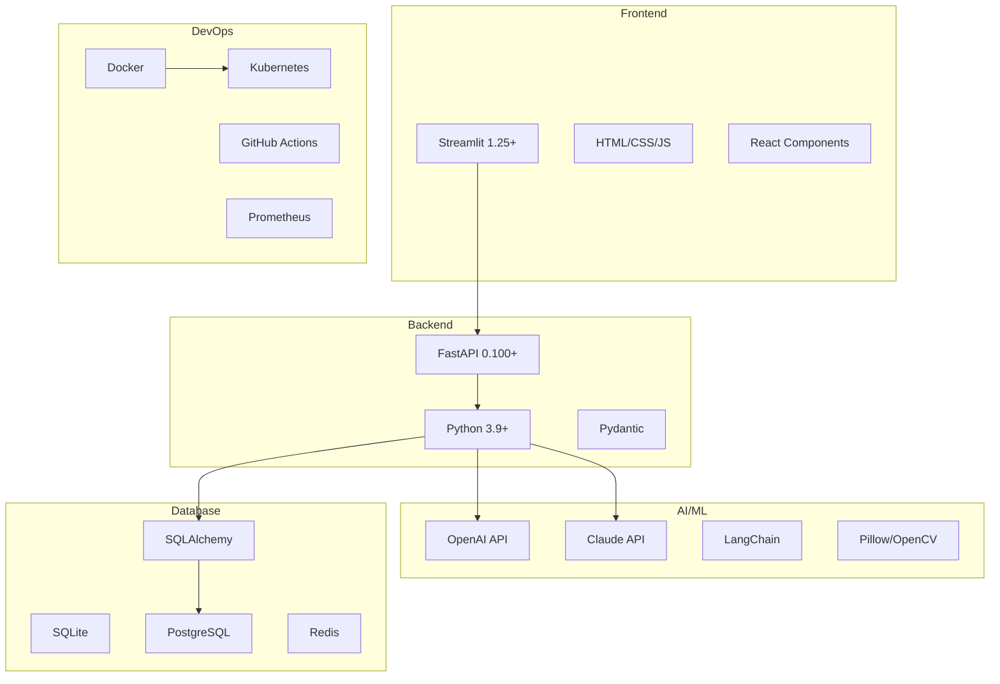

# RepairGPT 技術スタック仕様書

## 1. 概要

RepairGPTは、Python エコシステムを中心とした現代的な技術スタックで構築されています。AI/ML技術とWeb技術を組み合わせ、スケーラブルで保守性の高いアーキテクチャを実現しています。

## 2. 技術スタック全体像

### 2.1 技術マップ



### 2.2 技術選定理由

| 技術 | 選定理由 | 代替案 |
|------|----------|--------|
| Python | AI/ML エコシステム、開発速度 | Node.js, Go |
| FastAPI | 高性能、型安全、自動ドキュメント | Flask, Django |
| Streamlit | 迅速なUI開発、データサイエンス向け | React, Vue.js |
| PostgreSQL | 信頼性、ACID準拠、JSON対応 | MySQL, MongoDB |
| Redis | 高速キャッシュ、セッション管理 | Memcached, Hazelcast |

## 3. 開発環境

### 3.1 必須ツール

| カテゴリ | ツール | バージョン | 用途 |
|----------|--------|------------|------|
| 言語 | Python | 3.9+ | メイン開発言語 |
| パッケージ管理 | pip | 21.0+ | 依存関係管理 |
| 仮想環境 | venv | 標準ライブラリ | 環境分離 |
| エディタ | VS Code | 1.70+ | 推奨IDE |
| バージョン管理 | Git | 2.30+ | ソースコード管理 |

### 3.2 推奨ツール

| カテゴリ | ツール | 用途 |
|----------|--------|------|
| Python管理 | pyenv | バージョン管理 |
| 依存関係 | pip-tools | requirements管理 |
| シェル | zsh/bash | コマンドライン |
| DB管理 | pgAdmin | PostgreSQL管理 |
| API テスト | Postman | API動作確認 |

## 4. バックエンド技術

### 4.1 Web フレームワーク

#### FastAPI 0.100+
```python
from fastapi import FastAPI, HTTPException
from pydantic import BaseModel

app = FastAPI(title="RepairGPT API", version="1.0.0")

class RepairRequest(BaseModel):
    device: str
    issue: str

@app.post("/repair/diagnose")
async def diagnose_issue(request: RepairRequest):
    # 診断処理
    return {"diagnosis": "診断結果"}
```

**特徴**:
- 高性能（NodeJS並み）
- 型安全（Pydantic）
- 自動ドキュメント生成
- 非同期処理対応

#### Pydantic 2.0+
```python
from pydantic import BaseModel, Field, validator
from typing import Optional, List

class DeviceModel(BaseModel):
    name: str = Field(..., description="デバイス名")
    category: str = Field(..., description="カテゴリ")
    issues: List[str] = Field(default_factory=list)
    
    @validator('name')
    def validate_name(cls, v):
        if len(v) < 2:
            raise ValueError('名前は2文字以上である必要があります')
        return v
```

### 4.2 データベース

#### SQLAlchemy 2.0+
```python
from sqlalchemy import create_engine, Column, Integer, String, DateTime
from sqlalchemy.ext.declarative import declarative_base
from sqlalchemy.orm import sessionmaker

Base = declarative_base()

class RepairLog(Base):
    __tablename__ = 'repair_logs'
    
    id = Column(Integer, primary_key=True)
    device_name = Column(String, nullable=False)
    issue_description = Column(String, nullable=False)
    created_at = Column(DateTime, default=datetime.utcnow)
```

#### PostgreSQL 14+
```sql
-- 修理ログテーブル
CREATE TABLE repair_logs (
    id SERIAL PRIMARY KEY,
    device_name VARCHAR(255) NOT NULL,
    issue_description TEXT NOT NULL,
    diagnosis_result JSONB,
    created_at TIMESTAMP DEFAULT CURRENT_TIMESTAMP
);

-- インデックス
CREATE INDEX idx_repair_logs_device ON repair_logs(device_name);
CREATE INDEX idx_repair_logs_created ON repair_logs(created_at);
```

#### Redis 7.0+
```python
import redis
from typing import Optional

class CacheManager:
    def __init__(self, redis_url: str):
        self.redis = redis.from_url(redis_url)
    
    def get_repair_cache(self, key: str) -> Optional[dict]:
        """修理データキャッシュを取得"""
        data = self.redis.get(key)
        return json.loads(data) if data else None
    
    def set_repair_cache(self, key: str, data: dict, expire: int = 3600):
        """修理データキャッシュを設定"""
        self.redis.set(key, json.dumps(data), ex=expire)
```

## 5. フロントエンド技術

### 5.1 Streamlit 1.25+

```python
import streamlit as st
import requests
from PIL import Image

st.set_page_config(
    page_title="RepairGPT",
    page_icon="🔧",
    layout="wide"
)

# サイドバー
with st.sidebar:
    st.title("🔧 RepairGPT")
    device = st.selectbox(
        "デバイスを選択",
        ["Nintendo Switch", "PlayStation 5", "iPhone"]
    )

# メインエリア
col1, col2 = st.columns([2, 1])

with col1:
    # チャットインターフェース
    user_input = st.text_input("問題を説明してください")
    
    if st.button("診断開始"):
        response = requests.post(
            "http://localhost:8000/repair/diagnose",
            json={"device": device, "issue": user_input}
        )
        st.json(response.json())

with col2:
    # 画像アップロード
    uploaded_file = st.file_uploader(
        "画像をアップロード",
        type=['jpg', 'jpeg', 'png']
    )
    
    if uploaded_file:
        image = Image.open(uploaded_file)
        st.image(image, caption="アップロード画像")
```

### 5.2 カスタムコンポーネント

```python
import streamlit.components.v1 as components

def repair_steps_component(steps: list):
    """修理手順表示コンポーネント"""
    html_content = f"""
    <div class="repair-steps">
        <h3>修理手順</h3>
        <ol>
            {"".join([f"<li>{step}</li>" for step in steps])}
        </ol>
    </div>
    
    <style>
        .repair-steps {{
            background-color: #f0f2f6;
            padding: 20px;
            border-radius: 10px;
            margin: 10px 0;
        }}
        .repair-steps li {{
            margin: 10px 0;
            padding: 5px;
        }}
    </style>
    """
    
    components.html(html_content, height=400)
```

## 6. AI/ML技術

### 6.1 大規模言語モデル

#### OpenAI API
```python
import openai
from typing import List, Dict

class OpenAIClient:
    def __init__(self, api_key: str):
        self.client = openai.OpenAI(api_key=api_key)
    
    def generate_repair_guide(
        self, 
        device: str, 
        issue: str,
        context: List[Dict] = None
    ) -> str:
        """修理ガイドを生成"""
        messages = [
            {
                "role": "system",
                "content": "あなたは電子機器修理の専門家です。"
            },
            {
                "role": "user",
                "content": f"{device}の{issue}について修理方法を教えてください。"
            }
        ]
        
        response = self.client.chat.completions.create(
            model="gpt-4",
            messages=messages,
            max_tokens=1000,
            temperature=0.7
        )
        
        return response.choices[0].message.content
```

#### Claude API
```python
import anthropic
from typing import Optional

class ClaudeClient:
    def __init__(self, api_key: str):
        self.client = anthropic.Anthropic(api_key=api_key)
    
    def analyze_complex_issue(
        self, 
        device: str, 
        issue: str,
        image_data: Optional[str] = None
    ) -> str:
        """複雑な問題を分析"""
        prompt = f"""
        Human: {device}で{issue}が発生しています。
        詳細な診断と修理手順を提供してください。

        Assistant: """
        
        response = self.client.messages.create(
            model="claude-3-opus-20240229",
            max_tokens=1000,
            messages=[{"role": "user", "content": prompt}]
        )
        
        return response.content[0].text
```

### 6.2 画像処理

#### Pillow + OpenCV
```python
from PIL import Image, ImageEnhance
import cv2
import numpy as np

class ImageProcessor:
    def __init__(self):
        self.max_size = (1024, 1024)
    
    def process_repair_image(self, image_path: str) -> np.ndarray:
        """修理用画像を処理"""
        # PIL で読み込み
        image = Image.open(image_path)
        
        # サイズ調整
        image.thumbnail(self.max_size, Image.LANCZOS)
        
        # 品質向上
        enhancer = ImageEnhance.Sharpness(image)
        image = enhancer.enhance(1.5)
        
        # OpenCV 形式に変換
        cv_image = cv2.cvtColor(np.array(image), cv2.COLOR_RGB2BGR)
        
        return cv_image
    
    def detect_damage(self, image: np.ndarray) -> List[Dict]:
        """損傷を検出"""
        # エッジ検出
        gray = cv2.cvtColor(image, cv2.COLOR_BGR2GRAY)
        edges = cv2.Canny(gray, 50, 150)
        
        # 輪郭検出
        contours, _ = cv2.findContours(
            edges, cv2.RETR_EXTERNAL, cv2.CHAIN_APPROX_SIMPLE
        )
        
        damages = []
        for contour in contours:
            area = cv2.contourArea(contour)
            if area > 100:  # 小さい領域は無視
                x, y, w, h = cv2.boundingRect(contour)
                damages.append({
                    "area": area,
                    "position": {"x": x, "y": y, "w": w, "h": h}
                })
        
        return damages
```

### 6.3 プロンプト管理

#### LangChain
```python
from langchain.prompts import PromptTemplate
from langchain.chains import LLMChain
from langchain.llms import OpenAI

class RepairPromptManager:
    def __init__(self):
        self.diagnosis_template = PromptTemplate(
            input_variables=["device", "symptoms", "context"],
            template="""
            あなたは{device}の修理専門家です。
            
            症状: {symptoms}
            
            追加情報: {context}
            
            以下の形式で回答してください:
            1. 診断結果
            2. 修理手順
            3. 必要な工具
            4. 安全上の注意事項
            """
        )
    
    def create_diagnosis_chain(self, llm):
        """診断チェーンを作成"""
        return LLMChain(
            llm=llm,
            prompt=self.diagnosis_template
        )
```

## 7. データ管理

### 7.1 データベース設計

```python
# models.py
from sqlalchemy import Column, Integer, String, DateTime, Text, JSON, ForeignKey
from sqlalchemy.ext.declarative import declarative_base
from sqlalchemy.orm import relationship

Base = declarative_base()

class Device(Base):
    __tablename__ = 'devices'
    
    id = Column(Integer, primary_key=True)
    name = Column(String(255), nullable=False)
    category = Column(String(100), nullable=False)
    manufacturer = Column(String(100))
    model = Column(String(100))
    
    # リレーション
    repair_logs = relationship("RepairLog", back_populates="device")

class RepairLog(Base):
    __tablename__ = 'repair_logs'
    
    id = Column(Integer, primary_key=True)
    device_id = Column(Integer, ForeignKey('devices.id'))
    user_session = Column(String(255))
    issue_description = Column(Text, nullable=False)
    diagnosis_result = Column(JSON)
    repair_steps = Column(JSON)
    success_rate = Column(Integer, default=0)
    created_at = Column(DateTime, default=datetime.utcnow)
    
    # リレーション
    device = relationship("Device", back_populates="repair_logs")
```

### 7.2 キャッシュ戦略

```python
from functools import wraps
import json
import hashlib

def cache_repair_result(expire_time: int = 3600):
    """修理結果をキャッシュするデコレータ"""
    def decorator(func):
        @wraps(func)
        def wrapper(*args, **kwargs):
            # キャッシュキー生成
            cache_key = f"repair:{hashlib.md5(
                json.dumps(kwargs, sort_keys=True).encode()
            ).hexdigest()}"
            
            # キャッシュから取得
            cached_result = cache_manager.get_repair_cache(cache_key)
            if cached_result:
                return cached_result
            
            # 実行してキャッシュに保存
            result = func(*args, **kwargs)
            cache_manager.set_repair_cache(cache_key, result, expire_time)
            
            return result
        return wrapper
    return decorator
```

## 8. 外部API統合

### 8.1 iFixit API
```python
import httpx
from typing import List, Dict, Optional

class IFixitClient:
    def __init__(self, base_url: str = "https://www.ifixit.com/api/2.0"):
        self.base_url = base_url
        self.client = httpx.AsyncClient()
    
    async def search_guides(
        self, 
        device: str, 
        limit: int = 10
    ) -> List[Dict]:
        """修理ガイドを検索"""
        url = f"{self.base_url}/guides"
        params = {
            "filter": "category",
            "limit": limit
        }
        
        response = await self.client.get(url, params=params)
        response.raise_for_status()
        
        return response.json()
    
    async def get_guide_details(self, guide_id: int) -> Dict:
        """ガイド詳細を取得"""
        url = f"{self.base_url}/guides/{guide_id}"
        
        response = await self.client.get(url)
        response.raise_for_status()
        
        return response.json()
```

### 8.2 API レート制限
```python
import asyncio
from datetime import datetime, timedelta

class RateLimiter:
    def __init__(self, max_calls: int, time_window: int):
        self.max_calls = max_calls
        self.time_window = time_window
        self.calls = []
    
    async def wait_if_needed(self):
        """必要に応じて待機"""
        now = datetime.now()
        
        # 時間窓内のコール数をカウント
        self.calls = [
            call_time for call_time in self.calls
            if now - call_time < timedelta(seconds=self.time_window)
        ]
        
        if len(self.calls) >= self.max_calls:
            sleep_time = self.time_window - (now - self.calls[0]).total_seconds()
            await asyncio.sleep(sleep_time)
        
        self.calls.append(now)
```

## 9. セキュリティ

### 9.1 認証・認可
```python
from fastapi import Depends, HTTPException, status
from fastapi.security import HTTPBearer, HTTPAuthorizationCredentials
from jose import JWTError, jwt
from datetime import datetime, timedelta

security = HTTPBearer()

class AuthManager:
    def __init__(self, secret_key: str):
        self.secret_key = secret_key
        self.algorithm = "HS256"
    
    def create_access_token(self, data: dict, expires_delta: timedelta = None):
        """アクセストークンを作成"""
        to_encode = data.copy()
        if expires_delta:
            expire = datetime.utcnow() + expires_delta
        else:
            expire = datetime.utcnow() + timedelta(hours=24)
        
        to_encode.update({"exp": expire})
        encoded_jwt = jwt.encode(to_encode, self.secret_key, algorithm=self.algorithm)
        return encoded_jwt
    
    def verify_token(self, credentials: HTTPAuthorizationCredentials = Depends(security)):
        """トークンを検証"""
        try:
            payload = jwt.decode(
                credentials.credentials, 
                self.secret_key, 
                algorithms=[self.algorithm]
            )
            username: str = payload.get("sub")
            if username is None:
                raise HTTPException(
                    status_code=status.HTTP_401_UNAUTHORIZED,
                    detail="Invalid authentication credentials"
                )
            return username
        except JWTError:
            raise HTTPException(
                status_code=status.HTTP_401_UNAUTHORIZED,
                detail="Invalid authentication credentials"
            )
```

### 9.2 入力検証
```python
from pydantic import BaseModel, validator, Field
from typing import Optional
import re

class RepairRequest(BaseModel):
    device: str = Field(..., min_length=1, max_length=100)
    issue: str = Field(..., min_length=10, max_length=1000)
    user_session: Optional[str] = Field(None, max_length=255)
    
    @validator('device')
    def validate_device(cls, v):
        # 許可されたデバイスのみ
        allowed_devices = [
            "Nintendo Switch", "PlayStation 5", "iPhone",
            "Xbox Series X", "Steam Deck"
        ]
        if v not in allowed_devices:
            raise ValueError(f'サポートされていないデバイス: {v}')
        return v
    
    @validator('issue')
    def validate_issue(cls, v):
        # 危険なスクリプトやHTMLをチェック
        if re.search(r'<script|javascript:|on\w+=', v, re.IGNORECASE):
            raise ValueError('不正な入力が検出されました')
        return v
```

## 10. テスト

### 10.1 テストフレームワーク

#### pytest
```python
import pytest
from fastapi.testclient import TestClient
from src.main import app

client = TestClient(app)

class TestRepairAPI:
    def test_diagnose_endpoint(self):
        """診断エンドポイントのテスト"""
        response = client.post(
            "/repair/diagnose",
            json={
                "device": "Nintendo Switch",
                "issue": "電源が入らない"
            }
        )
        assert response.status_code == 200
        assert "diagnosis" in response.json()
    
    def test_invalid_device(self):
        """無効なデバイスのテスト"""
        response = client.post(
            "/repair/diagnose",
            json={
                "device": "Unknown Device",
                "issue": "問題が発生しています"
            }
        )
        assert response.status_code == 422
```

#### pytest-asyncio
```python
import pytest
import asyncio
from src.clients.ifixit import IFixitClient

@pytest.mark.asyncio
async def test_ifixit_client():
    """iFixit クライアントのテスト"""
    client = IFixitClient()
    
    # ガイド検索テスト
    guides = await client.search_guides("Nintendo Switch")
    assert len(guides) > 0
    assert "title" in guides[0]
    
    # ガイド詳細取得テスト
    guide_id = guides[0]["guideid"]
    details = await client.get_guide_details(guide_id)
    assert "steps" in details
```

### 10.2 テストデータ

```python
# conftest.py
import pytest
from sqlalchemy import create_engine
from sqlalchemy.orm import sessionmaker
from src.database import Base

@pytest.fixture(scope="session")
def test_db():
    """テスト用データベース"""
    engine = create_engine("sqlite:///:memory:")
    Base.metadata.create_all(bind=engine)
    
    TestingSessionLocal = sessionmaker(autocommit=False, autoflush=False, bind=engine)
    
    yield TestingSessionLocal
    
    Base.metadata.drop_all(bind=engine)

@pytest.fixture
def sample_repair_data():
    """サンプル修理データ"""
    return {
        "device": "Nintendo Switch",
        "issue": "電源が入らない",
        "expected_diagnosis": "充電ケーブルの確認が必要",
        "repair_steps": [
            "充電ケーブルを確認",
            "電源ボタンを長押し",
            "リセットボタンを押す"
        ]
    }
```

## 11. 監視・ログ

### 11.1 ログ設定

```python
import logging
from pythonjsonlogger import jsonlogger

# ログフォーマット設定
logHandler = logging.StreamHandler()
formatter = jsonlogger.JsonFormatter()
logHandler.setFormatter(formatter)

logger = logging.getLogger()
logger.addHandler(logHandler)
logger.setLevel(logging.INFO)

class RepairLogger:
    def __init__(self, name: str):
        self.logger = logging.getLogger(name)
    
    def log_repair_request(self, device: str, issue: str, user_session: str):
        """修理リクエストをログ"""
        self.logger.info(
            "repair_request",
            extra={
                "device": device,
                "issue": issue,
                "user_session": user_session,
                "timestamp": datetime.utcnow().isoformat()
            }
        )
    
    def log_repair_success(self, device: str, repair_time: float):
        """修理成功をログ"""
        self.logger.info(
            "repair_success",
            extra={
                "device": device,
                "repair_time": repair_time,
                "timestamp": datetime.utcnow().isoformat()
            }
        )
```

### 11.2 メトリクス収集

```python
from prometheus_client import Counter, Histogram, Gauge
import time

# メトリクス定義
repair_requests_total = Counter(
    'repair_requests_total',
    'Total repair requests',
    ['device', 'status']
)

repair_duration = Histogram(
    'repair_duration_seconds',
    'Time spent on repair diagnosis'
)

active_sessions = Gauge(
    'active_sessions',
    'Number of active user sessions'
)

class MetricsCollector:
    def __init__(self):
        self.start_time = time.time()
    
    def record_repair_request(self, device: str, status: str):
        """修理リクエストを記録"""
        repair_requests_total.labels(device=device, status=status).inc()
    
    def record_repair_duration(self, duration: float):
        """修理時間を記録"""
        repair_duration.observe(duration)
    
    def update_active_sessions(self, count: int):
        """アクティブセッション数を更新"""
        active_sessions.set(count)
```

## 12. デプロイメント

### 12.1 Docker設定

```dockerfile
# Dockerfile
FROM python:3.9-slim

WORKDIR /app

# システム依存関係
RUN apt-get update && apt-get install -y \
    libpq-dev \
    gcc \
    && rm -rf /var/lib/apt/lists/*

# Python 依存関係
COPY requirements.txt .
RUN pip install --no-cache-dir -r requirements.txt

# アプリケーション
COPY src/ ./src/
COPY config/ ./config/

# ユーザー作成
RUN useradd -m -u 1000 appuser && chown -R appuser:appuser /app
USER appuser

# ポート公開
EXPOSE 8000 8501

# 起動コマンド
CMD ["uvicorn", "src.main:app", "--host", "0.0.0.0", "--port", "8000"]
```

### 12.2 Kubernetes設定

```yaml
# deployment.yaml
apiVersion: apps/v1
kind: Deployment
metadata:
  name: repairgpt-api
spec:
  replicas: 3
  selector:
    matchLabels:
      app: repairgpt-api
  template:
    metadata:
      labels:
        app: repairgpt-api
    spec:
      containers:
      - name: api
        image: repairgpt:latest
        ports:
        - containerPort: 8000
        env:
        - name: DATABASE_URL
          valueFrom:
            secretKeyRef:
              name: repairgpt-secrets
              key: database-url
        - name: OPENAI_API_KEY
          valueFrom:
            secretKeyRef:
              name: repairgpt-secrets
              key: openai-api-key
        resources:
          requests:
            memory: "512Mi"
            cpu: "250m"
          limits:
            memory: "1Gi"
            cpu: "500m"
        readinessProbe:
          httpGet:
            path: /health
            port: 8000
          initialDelaySeconds: 30
          periodSeconds: 10
        livenessProbe:
          httpGet:
            path: /health
            port: 8000
          initialDelaySeconds: 60
          periodSeconds: 30
```

## 13. まとめ

RepairGPTの技術スタックは、以下の特徴を持っています：

### 13.1 技術的優位性

- **高性能**: FastAPI + PostgreSQL による高速処理
- **型安全**: Pydantic による厳密な型チェック
- **スケーラブル**: Redis キャッシュ + 水平スケーリング対応
- **AI統合**: OpenAI/Claude API との seamless な統合
- **開発効率**: Streamlit による迅速なUI開発

### 13.2 運用面の利点

- **監視**: Prometheus + Grafana によるメトリクス監視
- **ログ**: 構造化ログによる効率的なデバッグ
- **セキュリティ**: JWT認証 + 入力検証による安全性
- **テスト**: pytest による包括的なテスト体制
- **デプロイ**: Docker + Kubernetes による自動化

### 13.3 今後の技術ロードマップ

- **マイクロサービス化**: 機能別サービス分割
- **GraphQL**: 効率的なAPI設計
- **WebSocket**: リアルタイム通信対応
- **カスタムモデル**: 専用AI モデルの訓練・デプロイ

---

**最終更新日**: 2024-01-09  
**バージョン**: 1.0.0  
**メンテナー**: RepairGPT開発チーム